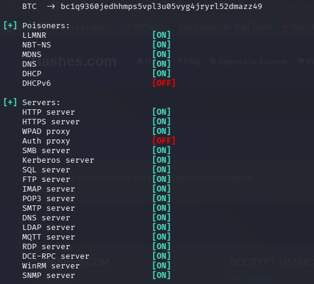
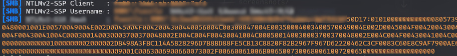
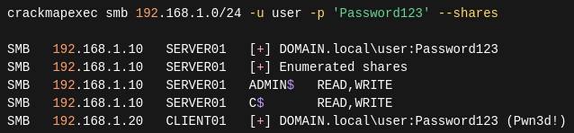
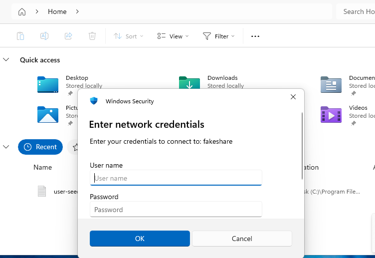

# 01 — LLMNR/NBT-NS Poisoning (Credential Capture)

> **Module:** Active Directory Attack Lab  
> **Technique:** LLMNR/NBT-NS Poisoning  
> **MITRE ATT&CK:** [T1557.001](https://attack.mitre.org/techniques/T1557/001/)  
> **Difficulty:** Beginner  
> **Environment:** Kali Linux → Windows Domain-Joined Machine (NAT)

---

## What is LLMNR Poisoning?

**Link-Local Multicast Name Resolution (LLMNR)** is a legacy Windows protocol used to resolve hostnames when DNS fails. When a machine cannot resolve a name, it broadcasts an LLMNR request to the entire subnet.

An attacker on the same network can respond to that broadcast — pretending to be the requested host — and trick the victim into sending their **NTLM authentication hash**.

---

## Attack Flow

Victim typos/misses a hostname
↓
Windows sends LLMNR broadcast (UDP 5355)
↓
Attacker (Responder) intercepts & responds
↓
Victim sends NTLM authentication attempt
↓
Responder captures the NTLMv2 hash
↓
Hash cracked offline → plaintext credential

---

## Lab Setup

| Role     | Machine                        |
|----------|-------------------------------|
| Attacker | Kali Linux (VMware)           |
| Victim   | Windows Domain-Joined Machine |
| Network  | NAT (same subnet)             |
| Tool     | Responder                     |

---

## Step-by-Step Walkthrough

### Step 1 — Start Responder on Kali

```bash
sudo responder -I eth0 -dPv
```

Responder listens on the network interface and poisons LLMNR/NBT-NS broadcasts.

### Step 2 — Trigger LLMNR Broadcast from Victim

On the Windows victim machine, navigate to a non-existent network share in File Explorer:

\\fakeshare

Windows fails DNS resolution and falls back to an LLMNR broadcast.


*Fig 1: Windows victim attempting to resolve a non-existent hostname via LLMNR broadcast*

---

### Step 3 — Responder Captures the NTLM Hash

Responder intercepts the broadcast, responds as the fake host, and captures the NTLMv2 hash sent by the victim during authentication.


*Fig 2: Responder successfully capturing the NTLMv2 hash from the victim machine*

---

### Step 4 — SMB Enumeration Activity

The attack also generates SMB authentication attempts across the network, visible in traffic analysis.


*Fig 3: SMB authentication activity triggered during the poisoning attack*

---

### Step 5 — Fake Share Interaction


*Fig 4: Victim machine interacting with the rogue/fake share served by Responder*

---

## SOC Detection Perspective

This attack generates identifiable signals across network and host logs:

### Network Indicators
| Signal | Description |
|--------|-------------|
| UDP port 5355 | LLMNR broadcast traffic |
| UDP port 137 | NBT-NS broadcast traffic |
| Rogue responses | Name resolution replies from non-DNS hosts |
| SMB traffic | Unexpected authentication attempts |

### Windows Event IDs to Monitor
| Event ID | Description |
|----------|-------------|
| 4648 | Logon attempt with explicit credentials |
| 4656 | Object (SMB share) access attempt |
| 5140 | Network share object accessed |

### Sample Splunk Query
```spl
index=windows EventCode=4648
| stats count by src_ip, dest_ip, Account_Name
| where count > 3
```

### Detection Tools
- **Suricata** — alert on unexpected UDP 5355 responses from non-DNS hosts
- **Splunk** — correlate Event IDs 4648 and 5140
- **Windows Event Logs** — monitor for NTLM authentication spikes

---

## Mitigation Strategies

| Action | How |
|--------|-----|
| Disable LLMNR | Group Policy → Computer Config → Admin Templates → DNS Client → Turn off multicast name resolution → **Enabled** |
| Disable NetBIOS over TCP/IP | Network adapter settings → WINS tab → Disable NetBIOS over TCP/IP |
| Enforce SMB Signing | Group Policy → `Microsoft network server: Digitally sign communications (always)` → **Enabled** |
| Strong password policy | Passwords over 12 characters significantly slow offline cracking |
| Monitor NTLM auth patterns | Alert on sudden spikes in NTLM authentication from a single host |

---

## MITRE ATT&CK Mapping

| Technique | ID |
|-----------|----|
| Adversary-in-the-Middle: LLMNR/NBT-NS Poisoning | [T1557.001](https://attack.mitre.org/techniques/T1557/001/) |
| Use of Valid Accounts | [T1078](https://attack.mitre.org/techniques/T1078/) |

---

## Key Takeaways

- LLMNR is a legacy protocol that should be disabled in all modern enterprise environments
- Attackers only need to be on the **same subnet** — no special privileges required
- Captured NTLMv2 hashes can be cracked offline with tools like **Hashcat** or **John the Ripper**
- Weak passwords are the biggest amplifier of this attack's impact
- Proper network segmentation and monitoring significantly reduce the attack surface

---

## Tools Used

| Tool | Purpose |
|------|---------|
| [Responder](https://github.com/lgandx/Responder) | LLMNR/NBT-NS poisoning & hash capture |
| Hashcat | Offline hash cracking |
| John the Ripper | Offline hash cracking (alternative) |

---

← [Back to Main Lab](../README.md)

